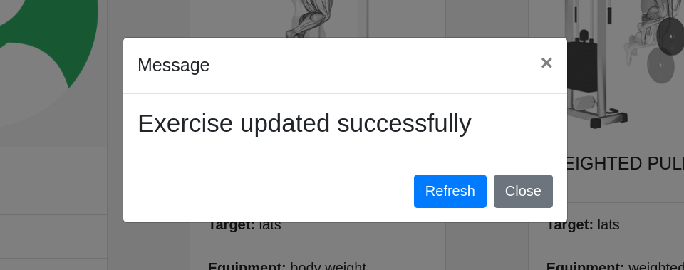

# Task 2

## UI

## Create Exercise

### 1

Click on Create to create an exercise

### 2

### 3

## Update Exercise

Click on update button and change the field values

### 1

### 2

## Delete Exercise

